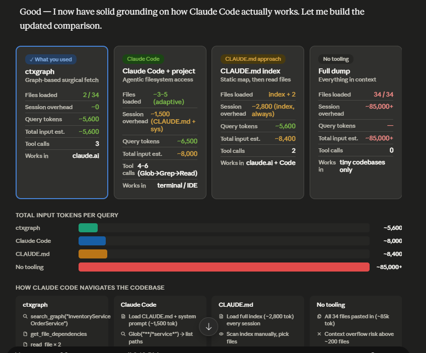

# ctxgraph — AI Context Engine for Python

## What is ctxgraph?

ctxgraph is a **knowledge graph engine** that makes AI coding assistants **97% cheaper** and **smarter**.

It analyzes your Python codebase using AST-based static analysis, builds a searchable dependency graph, and delivers *only the code that matters* to your AI — not every line in your project.

### Two ways to use it:

**🔌 MCP tool for any AI coding assistant** — Connect via `ctx serve` and give Claude Desktop, Claude Code, Cursor, or any MCP-compatible client surgical code context. No more Glob/Grep/Read token waste. Every graph query costs ~50 tokens vs 1,500+ for system prompts alone.

**🧠 Standalone AI assistant** — Hook up Ollama (free, local), Claude, or OpenAI, and ask questions, refactor code, debug issues, or explore architecture through `ctx ask` or `ctx chat` — just like ChatGPT or Claude Code, but with built-in codebase awareness.

```bash
pip install ctxgraph

ctx init                           # Scaffold .ctxgraph with config + default skills
ctx build                          # Build knowledge graph (AST analysis → SQLite)

# For Claude Desktop — add to claude_desktop_config.json
ctx serve --repo /path/to/project  # Start MCP server

# Or use standalone
ctx ask "how does JWT auth work"   # Ask questions with automatic token savings (needs LLM)
ctx capsule "fix JWT expiry"       # 92-99% fewer tokens vs raw code (no LLM needed)
ctx chat "refactor this module"    # Multi-turn conversation with persistent sessions
ctx history --stats                # Track total tokens saved across all queries
ccg "fix the login redirect bug"   # Launch Claude with context pre-loaded
ctx view                           # Interactive D3.js visualization (or --svg for static)
```


---

## Quick Start

```bash
# 0. Install with MCP support (for Claude Desktop)
pip install ctxgraph[mcp]

# 1. Initialize project
ctx init                           # Creates .ctxgraph/config.toml + default skills

# 2. Build the knowledge graph
ctx build                          # AST analysis → SQLite graph

# 3a. Connect to Claude Desktop (add to claude_desktop_config.json)
ctx serve --repo /path/to/project

# 3b. Ask questions directly (requires Ollama or other LLM provider)
ctx ask "how does authentication work"

# 3c. Or generate a capsule for any AI tool (no LLM needed)
ctx capsule "fix login rate limiter" --savings

# 4. Explore interactively
ctx chat                           # Multi-turn REPL with persistent sessions
```

---

## Why ctxgraph?

Sending entire files to an AI is wasteful. ctxgraph analyzes your code with AST-based static analysis, stores the result in a queryable SQLite graph, and retrieves *only the relevant nodes* — compressed into a token-efficient DSL format.

**No LLM? No problem.** ctxgraph's core features (graph building, capsule generation, search, visualization) work entirely offline. You only need an LLM provider when you want to ask questions via `ctx ask` or chat via `ctx chat`.

### Token cost per query: ctxgraph vs other approaches

Independent analysis by Claude compared ctxgraph's token efficiency against other common approaches for the same task — answering `"how does InventoryService link to OrderService"` in a real codebase:



| Approach | Total Input Tokens | Tool Calls | Session Overhead |
|---|---|---|---|
| **ctxgraph** (graph-based MCP) | **~5,600** | 3 | ~0 |
| Claude Code (agentic) | ~8,000 | 4–6 | ~1,500 (system prompt) |
| CLAUDE.md (static index) | ~8,400 | 2 | ~2,800 (static index) |
| No tooling (full dump) | ~85,000+ | 0 | — |

The key insight: **ctxgraph's graph is pre-built.** Graph queries cost ~50 tokens — you fetch only what you need. Agentic approaches (Claude Code) burn tokens exploring the filesystem. Static index approaches (CLAUDE.md) burn tokens loading a full index every session.

### Savings vs raw file dumps

| Without ctxgraph | With ctxgraph | Savings |
|:---|---:|:---:|
| All files dumped to context | Targeted capsule (10-40 nodes) | **97% fewer tokens** |
| JSON-formatted metadata | Custom DSL format | **4.7× less than JSON** |
| Model guesses filenames | Graph provides exact paths | **+16.7pp answer coverage** |

---

## How It Works

```
Repository (.py files)
    │
    ▼
┌─────────────────────────────────────────────────────────┐
│  ctx build                                               │
│                                                          │
│  1. importer.py (AST)  →  import edges (file→file)       │
│  2. symbols.py (AST)   →  classes, functions, methods    │
│  3. semantic.py        →  docstring summaries            │
│                                                          │
│  Store: SQLite (nodes + edges)                           │
└────────────────────────┬────────────────────────────────┘
                         │
                         ▼
┌─────────────────────────────────────────────────────────┐
│  ctx capsule "<query>"                                  │
│                                                          │
│  1. Tokenize query → keyword search                      │
│  2. Score: name matches (2x), text (0.5x)                │
│  3. BFS neighborhood expansion (depth=1-3)               │
│  4. Render token-efficient DSL → AI-ready capsule        │
└─────────────────────────────────────────────────────────┘
```

---

## Token Efficiency

### The DSL Advantage

ctxgraph's compact format uses **79% fewer tokens** than JSON for the same data:

```
JSON: 426 tokens                        DSL: 143 tokens
─────                                     ────
{                                         [CTX]calculator expression parsing
  "nodes": [
    {                                     [F]calc/parser.py
      "id": "file:calc/parser.py",         D:Tokenize and parse math expressions
      "type": "file",                      S:tokenize, parse, Expression
      "name": "parser.py",               [F]calc/core.py
      ...                                  D:Core math operations
    }                                     [C]Calculator
  ],                                       D:Main calculator class
  "edges": [...]                          [DEP]
}                                           parser.py → core.py
                                            parser.py → plugins.py
```

**4.7× compression ratio** vs equivalent JSON — tested across all benchmark projects.

### Capsule vs Raw Files

| Project | Files | Raw Tokens | Avg Capsule | Savings | Build Time |
|---------|:-----:|:----------:|:-----------:|:-------:|:----------:|
| tiny_app | 7 | 1,558 | ~112 | **92.8%** | ~82ms |
| web_api | 23 | 6,567 | ~136 | **97.9%** | ~474ms |
| microsvc | 22 | 10,587 | ~63 | **99.4%** | ~916ms |
| dataflow | 35 | ~12,500 | ~78 | **~99.4%** | ~560ms |

> **97.0% average token reduction** across 4 projects, 42 benchmark runs. The larger the project, the greater the savings.

### Token Savings Display

```bash
ctx capsule "user authentication" --savings
# ┌──────────────────────────┬──────────────┐
# │ Metric                   │ Value        │
# ├──────────────────────────┼──────────────┤
# │ Raw Project .py Files    │ 10,587 tokens│
# │ Capsule DSL              │ 132 tokens   │
# │ JSON Equivalent          │ 490 tokens   │
# │ Savings vs Raw           │ 98.8%        │
# │ DSL vs JSON              │ 73.1%        │
# └──────────────────────────┴──────────────┘
```

`ctx ask` and `ctx chat` show this automatically. See how many tokens you save with each interaction.

---

## Commands

### `ctx serve` — MCP server

Start the MCP protocol server for Claude Desktop and other MCP-compatible clients to query the knowledge graph directly.

```bash
pip install ctxgraph[mcp]
ctx serve --repo /path/to/your/project       # Explicit path (recommended for Claude Desktop)
ctx serve                                    # Auto-detect from cwd or CTXGRAPH_REPO_PATH
```

**Claude Desktop config** (use `--repo` or your project path):

```json
{
  "mcpServers": {
    "ctxgraph": {
      "command": "ctx",
      "args": ["serve", "--repo", "C:\\Users\\yourname\\projects\\myapp"]
    }
  }
}
```

Or set the `CTXGRAPH_REPO_PATH` environment variable instead of passing `--repo`:

```json
{
  "mcpServers": {
    "ctxgraph": {
      "command": "ctx",
      "args": ["serve"],
      "env": {
        "CTXGRAPH_REPO_PATH": "C:\\Users\\yourname\\projects\\myapp"
      }
    }
  }
}
```

Tools: `search_graph`, `get_context_capsule`, `get_file_dependencies`, `get_project_overview`, `read_file`, `search_files`.

> **Windows users:** Claude Desktop may not set the working directory to your project root. Always use `--repo` or `CTXGRAPH_REPO_PATH` to ensure the server can find your graph.

---

### `ctx init` — Scaffold project

```bash
ctx init                              # Default: current directory
ctx init /path/to/project             # Specific path
```

Creates a `.ctxgraph/` directory with everything you need:

```
.ctxgraph/
├── config.toml          # API provider, model, context settings
├── history.jsonl        # Query history (auto-created, auto-pruned to 1000)
└── skills/
    ├── project-style.toml   # Default skill: project conventions
    └── field-guide.toml     # Default skill: field guide
```

Idempotent — safe to run on existing projects. Existing files are never overwritten.

### `ctx build` — Build knowledge graph

```bash
ctx build                        # Current directory
ctx build /path/to/project       # Specific repo
ctx build --exclude "vendor/*"   # Custom exclude patterns
ctx build --provider claude      # Set LLM provider for later use
ctx build --model gpt-4o         # Set LLM model for later use
```

### `ctx ask <query>` — Ask questions via LLM

The marquee command. Generates a context capsule, sends it to your LLM provider, and shows token savings.

```bash
ctx ask "how does JWT auth work"                       # Uses configured provider (default: Ollama)
ctx ask "fix login bug" --provider claude --model claude-sonnet-4-20250514
ctx ask "refactor payment flow" --skill project-style   # Activate a skill as system prompt
ctx ask "find auth code" --graph                        # Show graph search results table
ctx ask "deep dive" --mode deep                         # Use deep graph context (40 nodes)
ctx ask "explain" --skill field-guide --graph            # Combine skill + graph results
```

**Flags:**

| Flag | Description |
|------|-------------|
| `--provider` | LLM provider: `ollama`, `claude`, `openai`, `azure`, `custom` |
| `--model` | Model name (e.g. `gpt-4o`, `claude-sonnet-4-20250514`) |
| `--skill` | Skill name to activate (e.g. `project-style`, `field-guide`) |
| `--graph` | Show ranked graph search results alongside the answer |
| `--mode` | Graph context mode: `fast`, `balanced` (default), `deep` |

**Requirements:**
- A built graph (run `ctx build` first)
- A running LLM provider (Ollama by default at `http://localhost:11434`)

**Example output:**

```bash
$ ctx ask "how does the greeting system work"

# (Token savings table shown automatically)
┌──────────────────────────┬──────────────┐
│ Metric                   │ Value        │
├──────────────────────────┼──────────────┤
│ Raw Project .py Files    │ 1,234 tokens │
│ Capsule DSL              │ 45 tokens    │
│ JSON Equivalent          │ 180 tokens   │
│ Savings vs Raw           │ 96.4%        │
│ DSL vs JSON              │ 75.0%        │
└──────────────────────────┴──────────────┘

Answer:
The greeting system is implemented in `src/greet.py`. The `greet()` function takes a name
and returns a formatted greeting string. The `Greeter` class extends this with a configurable
prefix. Both use type hints and follow the project conventions.
```

### `ctx chat [message]` — Interactive multi-turn conversation

Chat mode maintains a persistent session across turns. Sessions are saved to `.ctxgraph/chats/` and survive CLI restart.

#### Single-shot mode

```bash
ctx chat "how does the auth system work"       # Start or continue a session
ctx chat "what about the JWT tokens"           # Follow-up question — stays in REPL
ctx chat --new "explain the payment flow"      # Start a fresh session
```

#### Interactive REPL mode

Run `ctx chat` without a message to enter interactive mode. No session is created until you send your first message.

```bash
$ ctx chat
Chat Commands:
  /resume       Select and resume a previous session
  /compact      Compact current session (summarize oldest messages)
  /new          Start a fresh session
  /list         List all chat sessions
  /show         Show current session context
  /help         Show this help message
  /exit         Exit chat mode

Or type any message to send it to the LLM.

> how does the auth system work?
Started new session: a1b2c3d4

# (LLM answer + token savings table)
Session a1b2c3d4: 625/200,000 tokens used

> and the refresh tokens?
# (Continues same session — sends capsule + history)
Session a1b2c3d4: 1,234/200,000 tokens used

> /resume
# Use ↑/↓ to select a previous session, Enter to confirm
# (Resume session e5f6g7h8)

> /compact
Session compacted.

> /exit
```

#### Session picker (`/resume`)

Use the up/down arrow keys to navigate, Enter to select, Esc to cancel:

```
┌─────────────────────────────────────────────────────────────┐
│ Chat Sessions  (↑/↓ select, Enter confirm, Esc cancel)      │
├─────┬──────────┬───────┬────────┬───────────────────────────┤
│  #  │ ID       │ Turns │ Tokens │ Last                      │
├─────┼──────────┼───────┼────────┼───────────────────────────┤
│  1  │ a1b2c3d4 │     5 │  1,234 │ how does the auth system… │
│  2  │ e5f6g7h8 │     2 │    456 │ fix the login redirect…   │
└─────┴──────────┴───────┴────────┴───────────────────────────┘
```

#### Session management

- Sessions auto-compact when approaching the token limit (`max_session_tokens` in config, default 200k)
- Oldest turns are summarized into a compact system note; latest turns preserved
- Each session shows token usage at the end of every turn

**Flags:**

| Flag | Description |
|------|-------------|
| `--new` | Start a fresh session (discard previous context) |
| `--list`, `-l` | List all sessions with turn/token counts |
| `--show <id>` | View a session's transcript |
| `--compact`, `-c` | Manually trigger compaction |

### `ctx capsule <query>` — Generate context capsule

Generate a token-efficient DSL capsule for use with any AI tool.

```bash
ctx capsule "fix JWT token validation"              # Balanced (default: 20 nodes, depth 2)
ctx capsule "fix JWT token validation" --mode fast  # Fast (10 nodes, depth 1)
ctx capsule "fix JWT token validation" --mode deep  # Deep (40 nodes, depth 3)
ctx capsule --overview                              # Project architecture overview
ctx capsule "fix auth" --savings                    # Show token savings table
ctx capsule "fix auth" --skill project-style         # Prepends skill context
```

| Mode | Max Nodes | BFS Depth | When to Use |
|------|:---------:|:---------:|-------------|
| `fast` | 10 | 1 | Quick questions, small fixes |
| `balanced` (default) | 20 | 2 | General development |
| `deep` | 40 | 3 | Complex refactoring, architecture |

### `ctx query <search>` — Search graph

```bash
ctx query "user auth"
ctx query "payment gateway" --mode deep
```

Returns ranked nodes with relevance scores, displaying type, name, path, and score.

### `ctx view` — Visualize graph

```bash
ctx view                              # Opens interactive D3.js HTML in browser
ctx view --output graph.html          # Save to custom path
ctx view --svg                        # Generate static SVG
ctx view --no-open                    # Generate without opening browser
```

### `ctx history` — Query history

Review past questions, token savings, and provider usage.

```bash
ctx history                           # Last 10 queries
ctx history -n 20                     # Last 20
ctx history --filter "auth"           # Filter by keyword in query text
ctx history --stats                   # Aggregate statistics
```

**Example output:**

```bash
$ ctx history
┌────────────┬──────────────────────────────────────────────────┬─────────┬──────────┬──────────┐
│ Time       │ Query                                            │ Savings │ Provider │ Skill    │
├────────────┼──────────────────────────────────────────────────┼─────────┼──────────┼──────────┤
│ 2026-06-06 │ how does the greeting system work                │ 96.4%   │ ollama   │ -        │
│ 2026-06-06 │ fix login rate limiter                           │ 97.1%   │ ollama   │ -        │
│ 2026-06-06 │ refactor payment module with proper error handl… │ 95.8%   │ claude   │ project-style │
└────────────┴──────────────────────────────────────────────────┴─────────┴──────────┴──────────┘

$ ctx history --stats
┌──────────────────────┬───────────┐
│ Metric               │ Value     │
├──────────────────────┼───────────┤
│ Total Queries        │ 24        │
│ Total Raw Tokens     │ 254,088   │
│ Total Tokens Saved   │ 246,465   │
│ Avg Savings          │ 96.5%     │
│   Provider: ollama   │ 18        │
│   Provider: claude   │ 6         │
└──────────────────────┴───────────┘
```

History is stored as JSONL in `.ctxgraph/history.jsonl`. Auto-prunes to 1000 entries (oldest dropped).

### `ctx skill` — Manage skills

Skills are reusable system prompts that prepend project knowledge to your capsule context.

```bash
ctx skill list                         # Show all available skills
ctx skill show project-style           # Display a skill's contents
```

**Example:**

```bash
$ ctx skill list
┌─────────┬─────────────────┬────────────────────────────────────────────────────┐
│ Source  │ Name            │ Preview                                            │
├─────────┼─────────────────┼────────────────────────────────────────────────────┤
│ builtin │ project-style   │ # Project Style Guide — default ctxgraph skill     │
│ builtin │ field-guide     │ # Project Field Guide — default ctxgraph skill     │
└─────────┴─────────────────┴────────────────────────────────────────────────────┘

$ ctx skill show project-style
Skill: project-style

# Project Style Guide — default ctxgraph skill
# Activate with: ctx ask --skill project-style "..."

[about]
name = "Project Style Guide"
description = "Enforces project conventions, code style, and naming patterns"

[rules]
import_style = "absolute imports, grouped: stdlib, third-party, local"
naming = "snake_case for functions/variables, PascalCase for classes, UPPER_CASE for constants"
...
```

**Activating a skill:**

```bash
ctx ask "refactor payment flow" --skill project-style
ctx capsule "fix auth" --skill field-guide
```

When activated, the skill contents are prepended as a `## Project Knowledge` section before the capsule DSL.

**Creating your own skills:**

Skills are TOML files in `.ctxgraph/skills/`. Create a new file:

```toml
# .ctxgraph/skills/my-team-rules.toml

[about]
name = "Team Conventions"
description = "Custom team coding conventions"

[rules]
testing = "must write pytest tests for all new functions"
documentation = "every public API needs a docstring with Args and Returns"
branching = "prefer early returns over nested if-else"
```

Now it appears in `ctx skill list` and can be activated with `--skill my-team-rules`.

**Skill template:**

`ctx init` ships a fully-commented skill template at `.ctxgraph/skills/template.example.toml`. It shows every available section and their options:

```toml
# .ctxgraph/skills/template.example.toml (commented reference)
#
# [about]     — REQUIRED: name and description
# [rules]     — REQUIRED: instruction key/value pairs
# [context]   — OPTIONAL: file filters and limits
# [response]  — OPTIONAL: output formatting controls
# [output]    — OPTIONAL: save-to-file behavior
# [meta]      — OPTIONAL: author, version, requirements
```

To create a new skill, copy the file (remove `.example` from the name) and uncomment the sections you need.

### `ctx info` — Graph statistics

```bash
ctx info
# ┌────────────────────┬───────┐
# │ Total Nodes        │ 1090  │
# │ Total Edges        │ 1565  │
# │   files            │ 147   │
# │   classes          │ 45    │
# │   functions        │ 312   │
# └────────────────────┴───────┘
```

---

## Claude Wrapper (`ccg`)

The `ccg` command launches Claude Code with ctxgraph context pre-loaded:

```bash
ccg "fix the JWT expiry bug in auth module"          # Single-shot
ccg --chat "refactor the payment flow"               # Interactive session
ccg --overview                                        # Project overview
ccg --mode deep "redesign the database schema"        # Deep mode
```

---

## Configuration

`.ctxgraph/config.toml` is auto-created by `ctx init`:

```toml
[graph]
exclude = ["legacy/*", "vendor/*"]

[ai]
provider = "ollama"           # ollama, claude, openai, azure, custom
model = "qwen2.5-coder:7b"
endpoint = "http://localhost:11434"
api_key = ""
# For Azure provider, uncomment and set:
# azure_deployment = "my-gpt-4o-deployment"
# api_version = "2024-08-01-preview"

[context]
mode = "balanced"
max_nodes = 20
max_depth = 2

[chat]
# Max tokens per chat session before auto-compact
max_session_tokens = 200000
```

### Environment variables

| Variable | Overrides | Required For |
|----------|-----------|-------------|
| `CTXGRAPH_PROVIDER` | `ai.provider` | — |
| `CTXGRAPH_MODEL` | `ai.model` | — |
| `CTXGRAPH_ENDPOINT` | `ai.endpoint` | — |
| `ANTHROPIC_API_KEY` | `ai.api_key` | Claude provider |
| `OPENAI_API_KEY` | `ai.api_key` | OpenAI provider |
| `AZURE_OPENAI_API_KEY` | `ai.api_key` | Azure provider |
| `AZURE_OPENAI_DEPLOYMENT` | `ai.azure_deployment` | Azure deployment name |
| `AZURE_OPENAI_API_VERSION` | `ai.api_version` | Azure API version |

### Provider examples

```bash
# Ollama (default — no env vars needed)
ctx ask "how does auth work"

# Claude
CTXGRAPH_PROVIDER=claude CTXGRAPH_MODEL=claude-sonnet-4-20250514 ctx ask "explain the architecture"

# OpenAI
CTXGRAPH_PROVIDER=openai CTXGRAPH_MODEL=gpt-4o ctx ask "find the bug"

# Azure OpenAI
# Uses `api-key` header (not Bearer), requires `azure_deployment` and `api_version`
CTXGRAPH_PROVIDER=azure \
  CTXGRAPH_MODEL=gpt-4o \
  CTXGRAPH_ENDPOINT=https://my-resource.openai.azure.com \
  AZURE_OPENAI_API_KEY=sk-... \
  AZURE_OPENAI_DEPLOYMENT=my-gpt-4o-deployment \
  AZURE_OPENAI_API_VERSION=2024-08-01-preview \
  ctx ask "refactor this"
# The endpoint is your resource URL. The chat URL becomes:
#   /openai/deployments/{azure_deployment}/chat/completions?api-version={api_version}

# Custom (OpenAI-compatible)
CTXGRAPH_PROVIDER=custom CTXGRAPH_ENDPOINT=http://my-api/v1 ctx ask "explain"

# Per-command override (overrides both config and env vars)
ctx ask "how does this work" --provider claude --model claude-sonnet-4-20250514
```

> **Windows (PowerShell):** Use `$env:` prefix instead:
> ```powershell
> $env:CTXGRAPH_PROVIDER = "azure"; $env:CTXGRAPH_MODEL = "gpt-4o"; ctx ask "query"
> ```

---

## Use Cases

### Debug a failing test

```bash
ctx build
ctx capsule "test_user_login is failing with auth error" --mode deep
# → [F]tests/test_auth.py
#   [F]src/auth/login.py
#   [C]AuthService
#   [DEP] auth/login.py → core/database.py, auth/session.py

# Or ask directly:
ctx ask "test_user_login is failing" --mode deep
# → Explains the issue with file references and suggests fixes
```

### Understand a new codebase

```bash
ctx build
ctx capsule "project architecture" --overview
ccg --chat "explain the overall architecture and data flow"

# Or explore with skills active:
ctx ask "explain the architecture" --skill field-guide
```

### Refactor across modules

```bash
ctx capsule "extract payment processing into separate module" --mode deep
ctx ask "plan the payment module extraction" --skill project-style --mode deep
```

### Track your LLM usage

```bash
ctx history --stats
# Shows total queries, tokens saved, avg savings, provider breakdown
```

---

## Framework Integrations

ctxgraph is a Python library first — the CLI is just a wrapper. This makes it easy to feed code context into LangChain, LangGraph, OpenAI Agents, or any LLM pipeline.

### How the Python API works

The flow is always the same:

1. **`build_graph(path)`** → scans your code, stores a knowledge graph in `path/.ctxgraph/graph.db`
2. **`get_storage(path)`** → opens that SQLite database for queries (fast, no re-scanning)
3. **`render_capsule(storage, query)`** → searches the graph, returns a compact text capsule

```python
from pathlib import Path
from ctxgraph.graph.builder import build_graph, get_storage
from ctxgraph.capsule.renderer import render_capsule
from ctxgraph.graph.query import search_relevant_nodes

# --- Step 1: Build (one-time, ~0.1-1s per project) ---
stats = build_graph(Path("/path/to/my_project"))
print(f"Built: {stats['total_nodes']} nodes, {stats['total_edges']} edges")

# --- Step 2: Use (instant — reads the .db file) ---
storage = get_storage(Path("/path/to/my_project"))

# Generate a capsule — a token-efficient DSL string
capsule = render_capsule(storage, "fix JWT token validation", max_nodes=20)
print(capsule)
# → [CTX]fix JWT token validation
#   [F]src/auth/jwt.py
#     D:JWT token creation and validation
#   [F]src/auth/middleware.py
#     D:Auth middleware for request validation
#   ...

# Or search for nodes programmatically
results = search_relevant_nodes(storage, "auth login", max_nodes=10, max_depth=2)
for node, score in results:
    print(f"  {node.type}:{node.name}  (score={score})")
```

> **Tip:** `build_graph` is a one-time setup. In production, run `ctx build` during CI/deployment and let your app code only call `get_storage` + `render_capsule`.

### Compose with skill context

```python
from ctxgraph.skills import load_skill

storage = get_storage(Path("./my_project"))
skill_text = load_skill(Path("./my_project"), "project-style")
capsule = render_capsule(storage, "fix auth", max_nodes=20, skill_context=skill_text)
# Capsule now has "## Project Knowledge" section prepended
```

### Compute token savings

```python
from ctxgraph.capsule.savings import compute_savings

savings = compute_savings(Path("./my_project"), capsule_text)
print(f"Saved {savings['savings_pct']}% tokens")
print(f"DSL is {savings['dsl_vs_json_pct']}% more efficient than JSON")
```

### LangChain

Pass the capsule as context in your prompt template. The LLM gets exactly the files, classes, and dependencies it needs — no token waste.

```python
from pathlib import Path
from langchain_openai import ChatOpenAI
from langchain_core.prompts import ChatPromptTemplate
from ctxgraph.graph.builder import get_storage
from ctxgraph.capsule.renderer import render_capsule

storage = get_storage(Path("./my_project"))
context = render_capsule(storage, "login rate limiter", max_nodes=15)

prompt = ChatPromptTemplate.from_messages([
    ("system", "You are a senior Python dev. Answer using the code context below.\n\n{context}"),
    ("user", "{question}"),
])

llm = ChatOpenAI(model="gpt-4o")
response = prompt | llm | (lambda msg: msg.content)

print(response.invoke({
    "context": context,
    "question": "Where is the rate limiter applied in the login flow?",
}))
```

### LangGraph

Expose ctxgraph as a tool the agent calls on-demand.

```python
from pathlib import Path
from langgraph.graph import StateGraph, MessagesState
from langgraph.prebuilt import ToolNode
from langchain_openai import ChatOpenAI
from langchain_core.tools import tool
from ctxgraph.graph.builder import get_storage
from ctxgraph.capsule.renderer import render_capsule

_storage = get_storage(Path("./my_project"))

@tool
def code_context(task: str) -> str:
    """Fetch relevant source code for a development task."""
    return render_capsule(_storage, task, max_nodes=20)

tools = [code_context]
model = ChatOpenAI(model="gpt-4o", temperature=0).bind_tools(tools)

def agent_node(state: MessagesState):
    return {"messages": [model.invoke(state["messages"])]}

graph = StateGraph(MessagesState)
graph.add_node("agent", agent_node)
graph.add_node("tools", ToolNode(tools))
graph.set_entry_point("agent")
graph.add_conditional_edges(
    "agent",
    lambda s: "tools" if s["messages"][-1].tool_calls else "__end__",
)
graph.add_edge("tools", "agent")

app = graph.compile()

for chunk in app.stream({"messages": [("user", "How does payment retry work?")]}):
    for node, vals in chunk.items():
        msg = vals["messages"][0]
        if hasattr(msg, "content") and msg.content:
            print(f"[{node}]: {msg.content[:300]}")
```

### OpenAI Agents SDK

```python
from pathlib import Path
from agents import Agent, Runner, function_tool
from ctxgraph.graph.builder import get_storage
from ctxgraph.capsule.renderer import render_capsule

_storage = get_storage(Path("./my_project"))

@function_tool
def fetch_code_context(task_description: str) -> str:
    """Retrieve code context from the project's knowledge graph."""
    return render_capsule(_storage, task_description, max_nodes=20)

agent = Agent(
    name="Code Assistant",
    instructions="You help developers understand their codebase. Use fetch_code_context to get relevant files before answering.",
    model="gpt-4o",
    tools=[fetch_code_context],
)

result = Runner.run_sync(agent, "How does the notification system handle email vs SMS?")
print(result.final_output)
```

### Azure OpenAI (direct client)

```python
import os
from openai import AzureOpenAI
from pathlib import Path
from ctxgraph.graph.builder import get_storage
from ctxgraph.capsule.renderer import render_capsule

storage = get_storage(Path("./my_project"))
context = render_capsule(storage, "event bus architecture", max_nodes=25)

client = AzureOpenAI(
    api_version="2024-08-01-preview",
    azure_endpoint=os.environ["AZURE_OPENAI_ENDPOINT"],
    api_key=os.environ["AZURE_OPENAI_API_KEY"],
)

response = client.chat.completions.create(
    model="gpt-4o",
    messages=[
        {"role": "system", "content": f"You are a senior developer. Code context:\n\n{context}"},
        {"role": "user", "content": "How do I add a new event handler?"},
    ],
)
print(response.choices[0].message.content)
```

---

## Development

```bash
git clone https://github.com/shashi3070/ctxgraph.git
cd ctxgraph
pip install -e ".[dev]"
pytest                          # 88+ tests
python benchmarks/run_benchmarks.py
python benchmarks/run_ollama_comparison.py   # Requires local Ollama
```

### Project Structure

```
src/ctxgraph/
├── cli/main.py              — Typer CLI (9 commands)
├── graph/
│   ├── models.py            — Node, Edge, Graph dataclasses
│   ├── storage.py           — SQLite persistence
│   ├── builder.py           — Graph build orchestrator
│   └── query.py             — Tokenizer + BFS + relevance scoring
├── capsule/
│   ├── renderer.py          — DSL context generation
│   └── savings.py           — Token savings computation
├── analyzers/python/
│   ├── importer.py          — AST import extraction
│   ├── symbols.py           — AST class/function/method analysis
│   └── semantic.py          — Docstring summarization
├── config/
│   ├── init.py              — Project scaffold (.ctxgraph dir)
│   ├── settings.py          — TOML/JSON/env config loading
│   └── providers.py         — Ollama, Claude, OpenAI clients
├── chat.py                  — Chat session management (multi-turn, compaction)
├── clients/models.py        — Mode enum (fast/balanced/deep)
├── exclude/patterns.py      — Exclusion pattern matching
├── view/visualizer.py       — D3.js HTML graph generator
├── wrapper/claude.py        — ccg Claude wrapper
├── mcp/server.py            — MCP protocol server
├── skills/
│   ├── __init__.py          — Skill discovery + loading
│   ├── project-style.toml   — Default skill: project conventions
│   ├── field-guide.toml     — Default skill: field guide
│   └── template.example.toml — Commented skill template reference
└── history.py               — JSONL history append/query/stats
```

---

## Limitations

- **Python-only analysis** — other languages get file-level nodes only
- **Keyword-based search** — no semantic/embedding matching (planned)
- **No incremental rebuild** — full rebuild on every `ctx build` (planned)
- **MCP server** — stdio mode only, SSE not yet supported

---

## License

MIT
