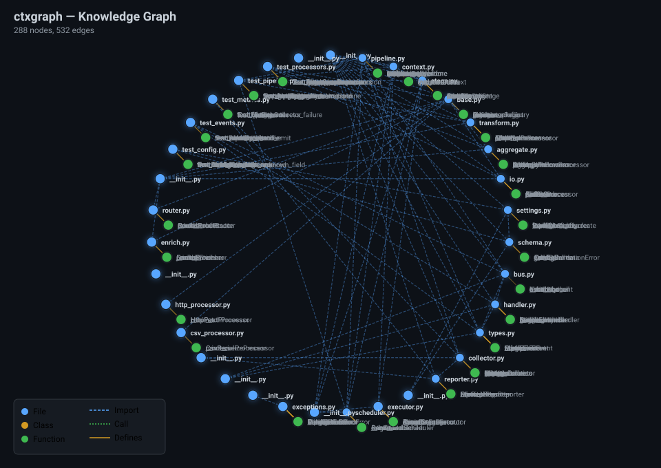

# ctxgraph — AI Context Engine for Python

**Slash your LLM token costs by 97%.** ctxgraph builds a multi-layer knowledge graph from your Python codebase, then generates *compact context capsules* — delivering only what your AI needs, not every line of code.

```bash
pip install ctxgraph

ctx build                          # Build knowledge graph
ctx capsule "fix JWT expiry"       # 92-99% fewer tokens vs raw code
ccg "fix the login redirect bug"   # Launch Claude with context pre-loaded
ctx view                           # Interactive D3.js visualization (or --svg for static)
```



---

## Why ctxgraph?

Sending entire files to an AI is wasteful. ctxgraph analyzes your code with AST-based static analysis, stores the result in a queryable SQLite graph, and retrieves *only the relevant nodes* — compressed into a token-efficient DSL format.

| Without ctxgraph | With ctxgraph | Savings |
|:---|---:|:---:|
| All files dumped to context | Targeted capsule (10-40 nodes) | **97% fewer tokens** |
| JSON-formatted metadata | Custom DSL format | **4.7× less than JSON** |
| Model guesses filenames | Graph provides exact paths | **+16.7pp answer coverage** |

---

## How It Works

```
Repository (.py files)
    │
    ▼
┌─────────────────────────────────────────────────────────┐
│  ctx build                                               │
│                                                          │
│  1. importer.py (AST)  →  import edges (file→file)       │
│  2. symbols.py (AST)   →  classes, functions, methods    │
│  3. semantic.py        →  docstring summaries            │
│                                                          │
│  Store: SQLite (nodes + edges)                           │
└────────────────────────┬────────────────────────────────┘
                         │
                         ▼
┌─────────────────────────────────────────────────────────┐
│  ctx capsule "<query>"                                  │
│                                                          │
│  1. Tokenize query → keyword search                      │
│  2. Score: name matches (2x), text (0.5x)                │
│  3. BFS neighborhood expansion (depth=1-3)               │
│  4. Render token-efficient DSL → AI-ready capsule        │
└─────────────────────────────────────────────────────────┘
```

### Architecture

```
┌─────────┐    ┌──────────────┐    ┌──────────────┐
│   CLI   │───▶│  Analyzers   │───▶│   SQLite DB  │
│  typer  │    │  AST-based   │    │  .ctxgraph/  │
└────┬────┘    └──────────────┘    └──────┬───────┘
     │                                    │
     ├── ctx build ──────────────────────▶│  Graph build
     │                                    │
     ├── ctx capsule ◀───────────────────│  Query + BFS
     │                                    │
     ├── ctx query ◀─────────────────────│  Keyword search
     │                                    │
     ├── ctx view ◀──────────────────────│  D3.js viz
     │                                    │
     ├── ctx serve ◀─────────────────────│  MCP server
     │                                    │
     └── ccg wrapper ───▶ Claude Code ───┘  AI tool
```

---

## Token Efficiency

### The DSL Advantage

ctxgraph's compact format uses **79% fewer tokens** than JSON for the same data:

```
JSON: 426 tokens                        DSL: 143 tokens
─────                                     ────
{                                         [CTX]calculator expression parsing
  "nodes": [
    {                                     [F]calc/parser.py
      "id": "file:calc/parser.py",         D:Tokenize and parse math expressions
      "type": "file",                      S:tokenize, parse, Expression
      "name": "parser.py",               [F]calc/core.py
      ...                                  D:Core math operations
    }                                     [C]Calculator
  ],                                       D:Main calculator class
  "edges": [...]                          [DEP]
}                                           parser.py → core.py
                                            parser.py → plugins.py
```

**4.7× compression ratio** vs equivalent JSON — tested across all benchmark projects.

### Capsule vs Raw Files

| Project | Files | Raw Tokens | Avg Capsule | Savings | Build Time |
|---------|:-----:|:----------:|:-----------:|:-------:|:----------:|
| tiny_app | 7 | 1,558 | ~112 | **92.8%** | ~82ms |
| web_api | 23 | 6,567 | ~136 | **97.9%** | ~474ms |
| microsvc | 22 | 10,587 | ~63 | **99.4%** | ~916ms |
| dataflow | 35 | ~12,500 | ~78 | **~99.4%** | ~560ms |

> **97.0% average token reduction** across 4 projects, 42 benchmark runs. The larger the project, the greater the savings.

### With Graph vs Without (Ollama)

| Query | No Context | With ctxgraph | Δ |
|-------|:----------:|:-------------:|:-:|
| Calculator expression parsing | 100% | 100% | — |
| Plugin registration system | 33% | **100%** | **+67pp** |
| JWT authentication (web_api) | 75% | **100%** | **+25pp** |
| Middleware pipeline (web_api) | 100% | 100% | — |
| Circuit breaker (microsvc) | 75% | 75% | — |
| Services & communication | 50% | **100%** | **+50pp** |
| PipelineBuilder pattern | 100% | 75% | -25pp* |
| Processor registration | 33% | **67%** | **+34pp** |
| Event bus & error handling | 100% | 100% | — |
> \* Without context the model gave a generic answer matching all keywords; with context it focused on actual code — more honest, more useful.

**+16.7pp average coverage improvement** — better answers, concrete file names, real code structure.

---

## Commands

### `ctx build` — Build knowledge graph
```bash
ctx build                        # Current directory
ctx build /path/to/project       # Specific repo
ctx build --exclude "vendor/*"   # Custom exclude patterns
```

### `ctx capsule <query>` — Generate context
```bash
ctx capsule "fix JWT token validation"              # Balanced (default: 20 nodes, depth 2)
ctx capsule "fix JWT token validation" --mode fast  # Fast (10 nodes, depth 1)
ctx capsule "fix JWT token validation" --mode deep  # Deep (40 nodes, depth 3)
ctx capsule --overview                              # Project architecture overview
```

| Mode | Max Nodes | BFS Depth | When to Use |
|------|:---------:|:---------:|-------------|
| `fast` | 10 | 1 | Quick questions, small fixes |
| `balanced` (default) | 20 | 2 | General development |
| `deep` | 40 | 3 | Complex refactoring, architecture |

### `ctx query <search>` — Search graph
```bash
ctx query "user auth"
ctx query "payment gateway" --mode deep
```
Returns ranked nodes with relevance scores.

### `ctx view` — Visualize graph
```bash
ctx view
ctx view --output graph.html
ctx view --port 8080 --no-open
```
Interactive D3.js force-directed HTML — no JS build tools needed.

### `ctx serve` — MCP server
```bash
pip install ctxgraph[mcp]
ctx serve
```
Claude Desktop config:
```json
{
  "mcpServers": {
    "ctxgraph": {
      "command": "ctx",
      "args": ["serve"]
    }
  }
}
```
Tools: `search_graph`, `get_context_capsule`, `get_file_dependencies`, `get_project_overview`.

### `ctx info` — Graph statistics
```bash
ctx info
# ┌────────────────────┬───────┐
# │ Total Nodes        │ 1090  │
# │ Total Edges        │ 1565  │
# │   files            │ 147   │
# │   classes          │ 45    │
# │   functions        │ 312   │
# └────────────────────┴───────┘
```

---

## Claude Wrapper (`ccg`)

```bash
ccg "fix the JWT expiry bug in auth module"          # Single-shot
ccg --chat "refactor the payment flow"               # Interactive session
ccg --overview                                        # Project overview
ccg --mode deep "redesign the database schema"        # Deep mode
```

---

## Configuration

`.ctxgraph/config.toml`:
```toml
[graph]
exclude = ["legacy/*", "vendor/*"]

[ai]
provider = "ollama"           # ollama, claude, openai, azure, custom
model = "qwen2.5-coder:7b"
endpoint = "http://localhost:11434"

[context]
mode = "balanced"
max_nodes = 20
max_depth = 2
```

| Environment Variable | Overrides |
|----------------------|-----------|
| `CTXGRAPH_PROVIDER` | `ai.provider` |
| `CTXGRAPH_MODEL` | `ai.model` |
| `CTXGRAPH_ENDPOINT` | `ai.endpoint` |
| `ANTHROPIC_API_KEY` | Claude API |
| `OPENAI_API_KEY` | OpenAI API |
| `AZURE_OPENAI_API_KEY` | Azure OpenAI API |

```bash
# Ollama (default)
ctx capsule "query"

# Claude
CTXGRAPH_PROVIDER=claude CTXGRAPH_MODEL=claude-sonnet-4-20250514 ctx capsule "query"

# OpenAI
CTXGRAPH_PROVIDER=openai CTXGRAPH_MODEL=gpt-4o ctx capsule "query"

# Azure OpenAI
CTXGRAPH_PROVIDER=azure \
  CTXGRAPH_MODEL=gpt-4o \
  CTXGRAPH_ENDPOINT=https://my-resource.openai.azure.com \
  AZURE_OPENAI_API_KEY=sk-... \
  ctx capsule "query"

# Custom (OpenAI-compatible)
CTXGRAPH_PROVIDER=custom CTXGRAPH_ENDPOINT=http://my-api/v1 ctx capsule "query"
```

---

## Use Cases

### Debug a failing test
```bash
ctx build
ctx capsule "test_user_login is failing with auth error" --mode deep
# → [F]tests/test_auth.py
#   [F]src/auth/login.py
#   [C]AuthService
#   [DEP] auth/login.py → core/database.py, auth/session.py
```

### Understand a new codebase
```bash
ctx capsule "project architecture" --overview
ccg --chat "explain the overall architecture and data flow"
```

### Refactor across modules
```bash
ctx capsule "extract payment processing into separate module" --mode deep
```

---

## Framework Integrations

ctxgraph can be used as a Python library — not just a CLI. This makes it easy to plug into LangChain, LangGraph, OpenAI Agents, or any custom AI pipeline.

### Python API

```python
from pathlib import Path
from ctxgraph.graph.builder import build_graph, get_storage
from ctxgraph.capsule.renderer import render_capsule
from ctxgraph.graph.query import search_relevant_nodes

# 1. Build the graph (one-time setup)
stats = build_graph(Path("/path/to/project"))
print(f"Built: {stats['total_nodes']} nodes, {stats['total_edges']} edges")

# 2. Get storage for an existing graph
storage = get_storage(Path("/path/to/project"))

# 3. Generate a context capsule (token-efficient text)
capsule = render_capsule(storage, "fix JWT token validation", max_nodes=20)
print(capsule)

# 4. Search for relevant nodes programmatically
results = search_relevant_nodes(storage, "auth login", max_nodes=10, max_depth=2)
for node, score in results:
    print(f"  {node.type}:{node.name}  (score={score})")
```

### LangChain

Inject ctxgraph capsules directly into your LangChain prompts — dramatically reducing token usage while providing precise code context.

```python
from pathlib import Path
from langchain_openai import ChatOpenAI
from langchain_core.prompts import ChatPromptTemplate
from ctxgraph.graph.builder import build_graph, get_storage
from ctxgraph.capsule.renderer import render_capsule

# Build graph once
build_graph(Path("./my_project"))
storage = get_storage(Path("./my_project"))

# Generate context for a specific task
context = render_capsule(storage, "user authentication flow", max_nodes=20)

prompt = ChatPromptTemplate.from_messages([
    ("system", "You are a senior Python developer. Use the code context below to answer the question.\n\n{context}"),
    ("user", "{question}"),
])

llm = ChatOpenAI(model="gpt-4o")
chain = prompt | llm

response = chain.invoke({
    "context": context,
    "question": "Where is the login rate limiter implemented?",
})
```

### LangGraph

Use ctxgraph as a tool within a LangGraph agent — the agent requests context capsules when it needs to understand the codebase.

```python
from pathlib import Path
from typing import Literal
from langgraph.graph import StateGraph, MessagesState
from langgraph.prebuilt import ToolNode
from langchain_openai import ChatOpenAI
from langchain_core.tools import tool
from ctxgraph.graph.builder import build_graph, get_storage
from ctxgraph.capsule.renderer import render_capsule

# Pre-build graph
build_graph(Path("./my_project"))
storage = get_storage(Path("./my_project"))

@tool
def code_context(task: str) -> str:
    """Get code context relevant to a task. Use this before answering code questions."""
    return render_capsule(storage, task, max_nodes=20)

tools = [code_context]
tool_node = ToolNode(tools)

model = ChatOpenAI(model="gpt-4o", temperature=0).bind_tools(tools)

def should_continue(state: MessagesState) -> Literal["tools", "__end__"]:
    return "tools" if state["messages"][-1].tool_calls else "__end__"

def call_model(state: MessagesState):
    return {"messages": [model.invoke(state["messages"])]}

graph = StateGraph(MessagesState)
graph.add_node("agent", call_model)
graph.add_node("tools", tool_node)
graph.set_entry_point("agent")
graph.add_conditional_edges("agent", should_continue)
graph.add_edge("tools", "agent")

app = graph.compile()

for chunk in app.stream({"messages": [("user", "Find the bug in the payment processor")]}):
    for node, msg in chunk.items():
        print(f"[{node}]: {msg['messages'][0].content[:200] if msg.get('messages') else ''}")
```

### OpenAI Agents SDK

Use ctxgraph with the official OpenAI Agents SDK (also works with Azure OpenAI via `AzureOpenAIChatCompletionAgent`).

```python
from pathlib import Path
from openai import AzureOpenAI  # or OpenAI for standard API
from agents import Agent, Runner, function_tool
from ctxgraph.graph.builder import build_graph, get_storage
from ctxgraph.capsule.renderer import render_capsule

# Pre-build the graph
build_graph(Path("./my_project"))
storage = get_storage(Path("./my_project"))

@function_tool
def fetch_code_context(task_description: str) -> str:
    """Retrieve relevant code context for a development task."""
    return render_capsule(storage, task_description, max_nodes=20)

agent = Agent(
    name="Code Assistant",
    instructions="You are a helpful coding assistant. Use the code context tool to understand the codebase before answering.",
    model="gpt-4o",  # or AzureOpenAIChatCompletionAgent(deployment="gpt-4o", ...)
    tools=[fetch_code_context],
)

result = Runner.run_sync(
    agent,
    "How does the JWT authentication middleware work?",
)
print(result.final_output)
```

### Azure OpenAI with Custom Agent

For Azure OpenAI, configure the client directly and inject ctxgraph context:

```python
import os
from openai import AzureOpenAI
from pathlib import Path
from ctxgraph.graph.builder import build_graph, get_storage
from ctxgraph.capsule.renderer import render_capsule

# Build graph
build_graph(Path("./my_project"))
storage = get_storage(Path("./my_project"))

# Generate context capsule
context = render_capsule(storage, "authentication and authorization", max_nodes=25)

client = AzureOpenAI(
    api_version="2024-08-01-preview",
    azure_endpoint=os.environ["AZURE_OPENAI_ENDPOINT"],
    api_key=os.environ["AZURE_OPENAI_API_KEY"],
)

response = client.chat.completions.create(
    model="gpt-4o",  # deployment name
    messages=[
        {"role": "system", "content": f"You are a senior Python developer. Use the code context below.\n\n{context}"},
        {"role": "user", "content": "Explain the role-based access control (RBAC) implementation."},
    ],
)
print(response.choices[0].message.content)
```

---

## Development

```bash
git clone https://github.com/shashi3070/ctxgraph.git
cd ctxgraph
pip install -e ".[dev]"
pytest
python benchmarks/run_benchmarks.py
python benchmarks/run_ollama_comparison.py   # Requires local Ollama
```

### Project Structure
```
src/ctxgraph/
├── cli/main.py              — Typer CLI (6 commands)
├── graph/
│   ├── models.py            — Node, Edge, Graph dataclasses
│   ├── storage.py           — SQLite persistence
│   ├── builder.py           — Graph build orchestrator
│   └── query.py             — Tokenizer + BFS + relevance scoring
├── capsule/renderer.py      — DSL context generation
├── analyzers/python/
│   ├── importer.py          — AST import extraction
│   ├── symbols.py           — AST class/function/method analysis
│   └── semantic.py          — Docstring summarization
├── config/
│   ├── settings.py          — TOML/JSON/env config loading
│   └── providers.py         — Ollama, Claude, OpenAI clients
├── clients/models.py        — Mode enum (fast/balanced/deep)
├── exclude/patterns.py      — Exclusion pattern matching
├── view/visualizer.py       — D3.js HTML graph generator
├── wrapper/claude.py        — ccg Claude wrapper
└── mcp/server.py            — MCP protocol server
```

---

## Limitations

- **Python-only analysis** — other languages get file-level nodes only
- **Keyword-based search** — no semantic/embedding matching (planned)
- **No incremental rebuild** — full rebuild on every `ctx build` (planned)
- **MCP server** — stdio mode only, SSE not yet supported

---

## License

MIT
